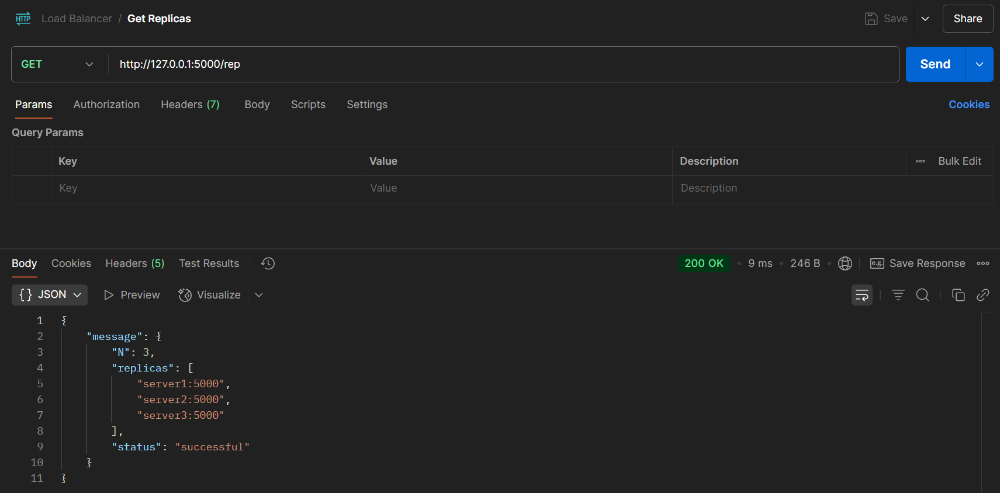
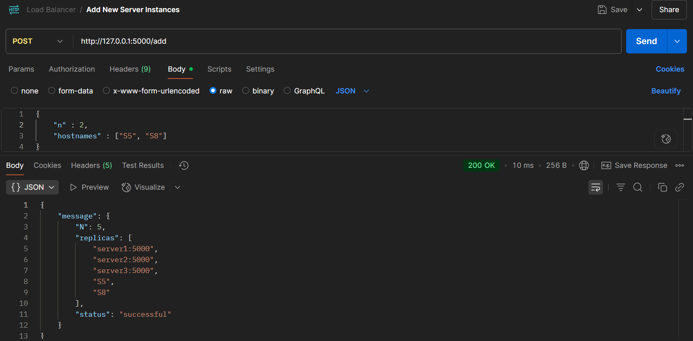
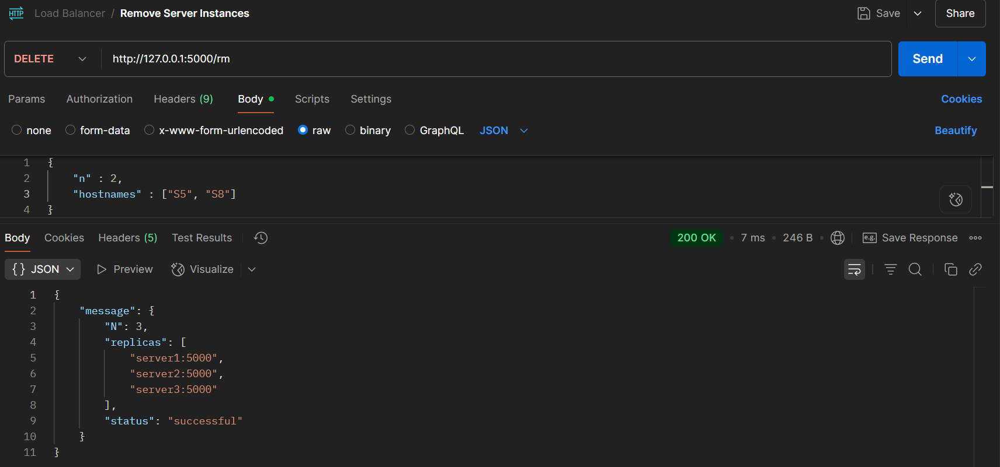
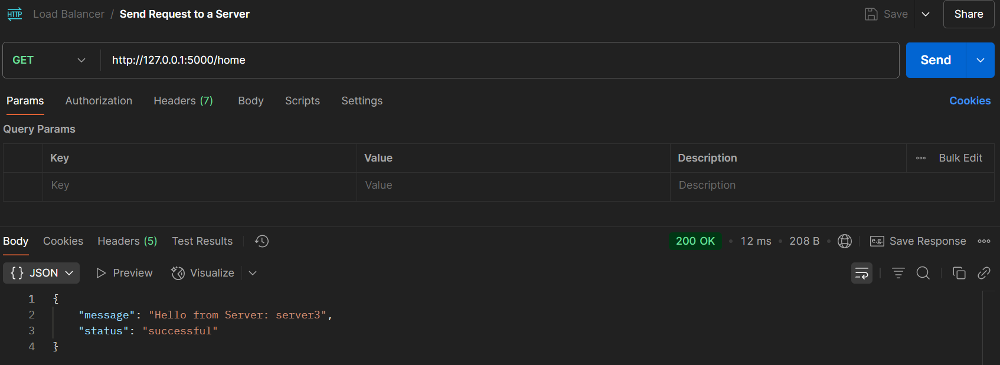
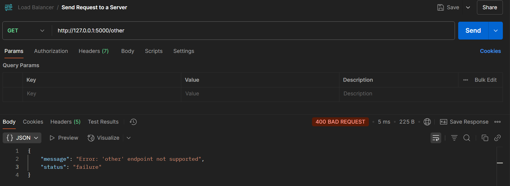
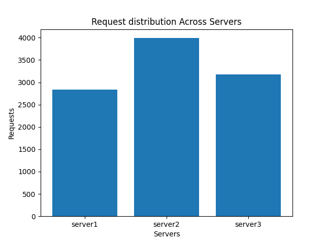
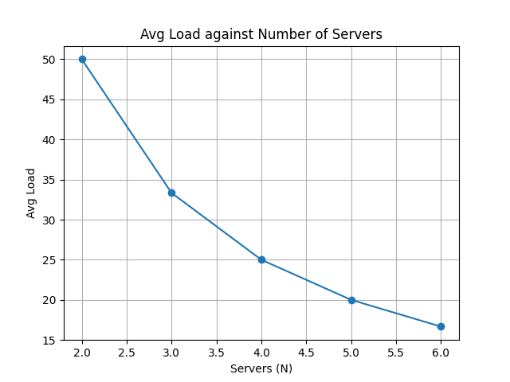

# Load-Balancer-Distributed-System
## Project Overview
This project involves implementing a load balancer that asynchronously routes requests between servers.
- In this repository, the tasks handled are divided into folders, corresponding to the task handled. For
instance, `TASK_1` contains scripts for Task 1, `TASK_2` has files for Task 2, and so on.
- The code for the servers can be found in `TASK_1/server.py`, and the final load balancer source code is located in 
`TASK_3/app.py`
- A detailed analysis on the load balancer's performance is outlined on this README as well as in 
`TASK_4/analysis.ipynb`.

## Table of Contents
- [Installation and Setup](#installation-and-setup)
  - [Pre-requisites](#pre-requisites)
  - [Setup Instructions](#setup-instructions)
- [Basic Usage](#basic-usage)
  - [Running Docker Services](#running-docker-services)
  - [Running Python Files](#running-python-files)
- [Repository Structure](#repository-structure)
- [Design Choices](#design-choices)
- [Assumptions](#assumptions)
- [Testing the Project](#testing-the-project)
  - [Endpoints](#endpoints)
  - [Testing with cURL](#testing-with-curl)
  - [Testing with Python](#testing-with-python-using-requests)
  - [Testing with Postman](#testing-with-postman)
- [Load Balancer Performance Analysis](#load-balancer-performance-analysis)
  - [A-1: Requests Count Per Server Instance](#a-1-request-count-per-server-instance)
  - [A-2: Average Load of Servers for N=2 to 6](#a-2-average-load-of-servers-for-n--2-to-6)
  - [A-3: Failure Detection and Handling](#a-3-failure-detection-and-handling)
  - [A-4: Modifying the Hash Functions](#a-4-modifying-the-hash-functions)

## Installation and Setup
### Pre-requisites
- Python 3.9+
- Docker Version 20.10.23 or above
- Ubuntu 20.04 LTS or above

### Setup Instructions
- Clone the repository:
```bash
git clone https://github.com/Twna-Jane/Load-Balancer-Distributed-System.git 
```

- Navigate to the repository:
```bash
cd Load-Balancer-Distributed-System
```

- Create a Python virtual environment:
```bash
python3 -m venv .venv
```

- Activate the virtual environment:
```bash
source .venv/bin/activate
```

- Install the required libraries:
```bash
pip install -r requirements.txt
```

## Basic Usage
### Running Docker Services
- Build images and start the services:
```bash
docker-compose up -d
```

- Verify that the containers are running:
```bash
docker-compose ps
```

- When you're done, you can stop and remove containers:
```bash
docker-compose down
```

### Running Python Files
- To run Python files while the virtual environment is active:
```bash
python app.py
```

## Repository Structure
```bash
├── .gitignore
├── README.md
├── TASK_1
│   ├── Dockerfile
│   ├── requirements.txt
│   └── server.py
├── TASK_2
│   ├── Dockerfile
│   ├── consistent_hash.py
│   ├── docker-compose.yml
│   ├── loadbalancer.py
│   └── requirements.txt
├── TASK_3
│   ├── Dockerfile
│   ├── app.py
│   ├── consistent_hash.py
│   ├── docker-compose.yml
│   └── requirements.txt
├── TASK_4
│   ├── analysis.ipynb
│   ├── analysis_one.py
│   ├── analysis_two.py
│   ├── consistent_hash.py
│   └── figures
│       ├── analysis_one.png
│       └── analysis_two.png
└── requirements.txt

```

## Design Choices
To implement the load balancer, Object-Oriented programming was applied.
- The hashing mechanism was implemented as a class called `ConsistentHashRing`, which contained attributes such as the
servers, slots, and virtual nodes to be created, and methods for implementing hashing and server allocation for a request.
- The servers and load balancer are implemented as Flask web servers, comprising the endpoints required for request 
handling and load balancing operations.

## Assumptions
- The following assumptions were made in the load balancer implementation:
1. Request IDs are generated randomly by the load balancer.
2. The load balancer is the only point of entry to the internal network - Clients only interact directly with the load 
balance, which handles request to, and from servers dynamically.
3. Server failure is detected through heartbeats.
4. Scaling is done manually via API - Servers are added and removed through the load balancer's APIs, hence no automatic 
scaling is done.

## Testing the Project
Postman, command-line tools like `cURL`, or Python scripts using the `requests` module can be used to perform tests
for the server(s) and load balancer. Example of tests using Postman have been provided in this section.

### Endpoints
#### Server Endpoints
Each server should have the following endpoints:

| Endpoint     | Method | Description               |
| ------------ | ------ | ------------------------- |
| `/home`      | GET    | Returns a success message |
| `/heartbeat` | GET    | Used for health checks    |

#### Load Balancer Endpoints
The load balancer exposes the following endpoints:

| Endpoint  | Method | Description                                                                   |
|-----------| ------ |-------------------------------------------------------------------------------|
| `/add`    | POST   | Adds new backend servers                                                      |
| `/rm`     | DELETE | Removes existing backend servers                                              |
| `/rep`    | GET    | Lists the currently active backend servers                                    |
| `/<path>` | GET    | A catch-all route that handles other endpoints to be directed to the servers. |

- The load balancer is exposed to the public network through the host machine on port 5000.

### Testing with cURL
#### 1. Test Load Balancer Routing

```bash
curl http://localhost:5000/home
```

#### 2. Add a New Server
```bash
curl -X POST http://localhost:5000/add \
  -H "Content-Type: application/json" \
  -d '{"n": 1, "hostnames": ["server4:5000"]}'
```

#### 3. Remove a Server
```bash
curl -X DELETE http://localhost:5000/rm \
  -H "Content-Type: application/json" \
  -d '{"n": 1, "hostnames": ["server4:5000"]}'
```

#### 4. List Active Servers
```bash
curl http://localhost:5000/rep
```

### Testing with Python (using `requests`)
#### 1. Test Load Balancer Routing
```python
import requests

response = requests.get("http://localhost:5000/home")
print(response.status_code, response.json())
```

#### 2. Add a New Server
```python
import requests

data = {"n": 1, "hostnames": ["server4:5000"]}
response = requests.post("http://localhost:5000/add", json=data)
print(response.status_code, response.json())
```

#### 3. Remove a Server
```python
import requests

data = {"n": 1, "hostnames": ["server4:5000"]}
response = requests.delete("http://localhost:5000/rm", json=data)
print(response.status_code, response.json())
```

#### 4. List Active Servers
```python
import requests

response = requests.get("http://localhost:5000/rep")
print(response.status_code, response.json())
```
- Examples of testing with Python can be found in the `analysis.ipynb` notebook provided in the TASK_4 directory.

### Testing with Postman
#### 1. Get Replicas


#### 2. Add Server Instances


#### 3. Remove Server Instances


#### 4. Request to `/home`


#### 5. Request to `/other`


## Load Balancer Performance Analysis
- For more details, refer to **`TASK_4/analysis.ipynb`**.

### A-1: Request Count Per Server Instance
- This experiment involved executing 10,000 async requests on the 3 server containers, with the results being displayed
in a bar chart.
- Asynchronous requests are launched by using `aiohttp` + `asyncio` for concurrent request handling.


#### Observations
From the graph, most of the requests (more than 90%) are handled by server1, with the rest handling a fairly even number
of requests. This may be caused by the hash function mapping requests to servers, which may be returning hash values 
that direct requests to server1. This represents an imbalance in the number of requests handled across the 3 servers, 
as server1 handles a large number of requests, leaving the rest of the servers under-utilised.

---

### A-2: Average Load of Servers for N = 2 to 6
- This experiment involved iteratively increasing the number of servers from 2 to 6 while launching async requests.
- The results are plotted on a line chart.


#### Observations
From the line chart, the average number of requests being handled per server is inversely proportional to the number of 
servers being handled by the load balancer. This behaviour is expected because more servers means fewer requests routed 
to a specific server, showing a case of horizontal scaling.

---

### A-3: Failure Detection and Handling
- This experiment analysed how the load balancer handles server failures.
- Server 1 was stopped to represent a server failure.

#### Observations
From the experiment, it was noted that majority of the requests were routed to server 2 compared to server 3, showing a 
significant imbalance which still existed based on the setup, despite the removal of server 1 (Refer to the notebook for 
more information).

---

### A-4: Modifying the Hash Functions
- The hash ring functions were modified and results gathered, based on the change.
- These were the new hash functions (defined arbitrarily) for the requests and servers that were used:
  - Request Hash Function: $\quad H(i) = (3 \cdot i) \mod S$
  - Server Hash Function: $\quad \phi(i, j) = (i^2 + 4 \cdot j) \mod S$

Based on the results gathered, server 1 handled significantly more request traffic than before, based on these new 
functions. There was no significant change noted for the average load per server, when the number of servers were 
increased, with the number of requests held constant.


